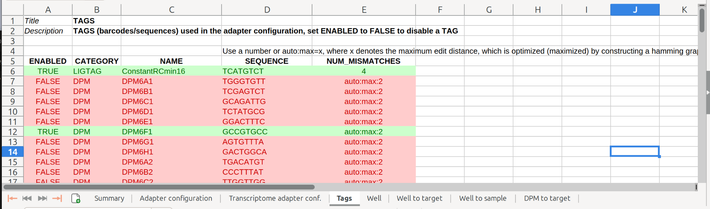
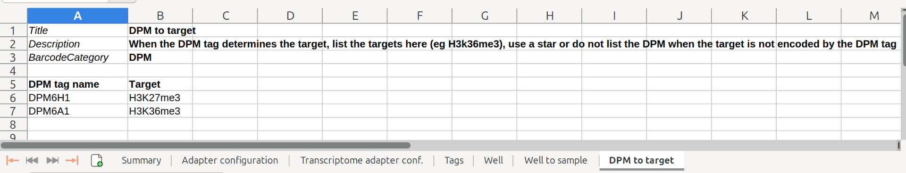
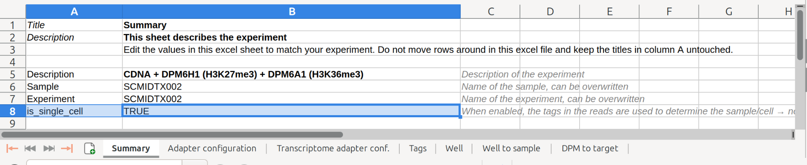
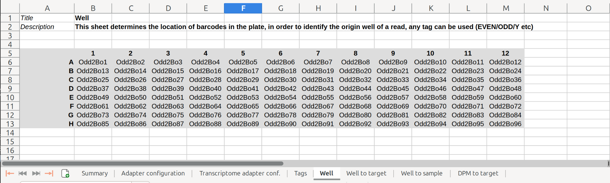
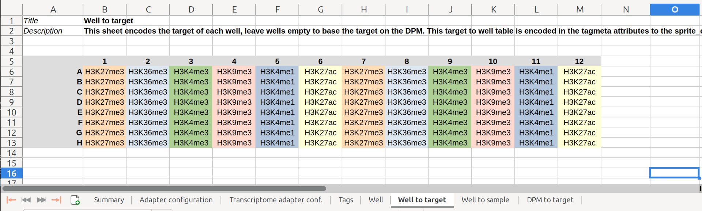
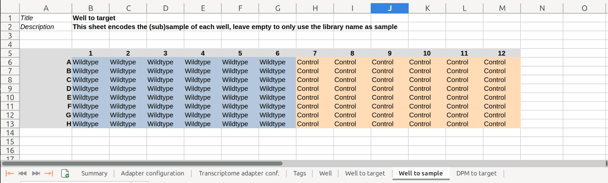
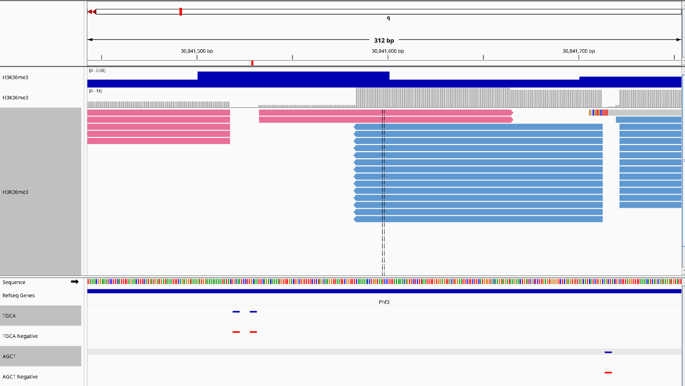
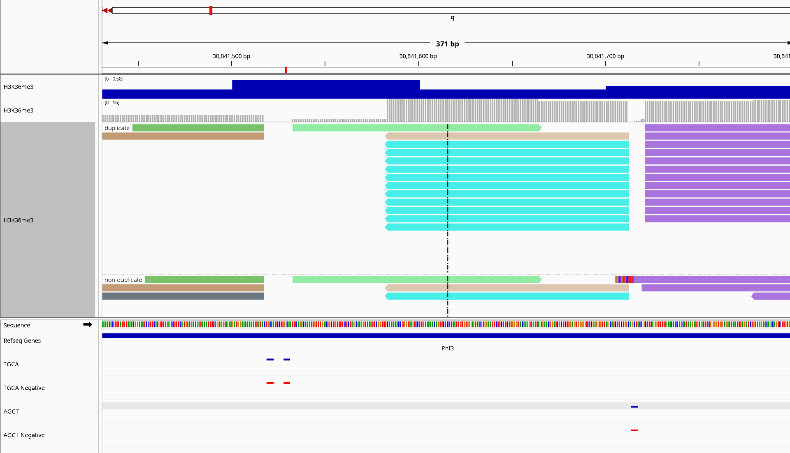

# Workflow Diagram


* [Workflow Diagram](#workflow-diagram)
* [Glossary](#glossary)
* [Workflow Overview](#workflow-overview)
* [Installation](#installation)
	+ [Prerequisites](#prerequisites)
		- [Nextflow Installation](#nextflow-installation)
		- [Containers](#containers)
			* [Docker container installation](#docker-container-installation)
		- [Scellgenpy (sample sheet only) installation](#scellgenpy-sample-sheet-only-installation)
	+ [Download the workflow](#download-the-workflow)
	+ [Prepare references](#prepare-references)
* [Workflow test run](#workflow-test-run)
	+ [Using scellgen_generate_mabid_workflow_config without docker](#using-scellgen_generate_mabid_workflow_config-without-docker)
	+ [Using docker](#using-docker)
	+ [Full workflow run including cDNA](#full-workflow-run-including-cdna)
* [Workflow configuration](#workflow-configuration)
	+ [Configuration files](#configuration-files)
		- [Reference Genome](#reference-genome)
	+ [Sample configuration](#sample-configuration)
		- [Input Directory Structure](#input-directory-structure)
		- [gDNA Library](#gdna-library)
		- [gDNA Library with Negative Control (Bulk only)](#gdna-library-with-negative-control-bulk-only)
		- [gDNA + cDNA Library:](#gdna-cdna-library)
	+ [Excel Sheet Configuration](#excel-sheet-configuration)
		- [Summary](#summary)
		- [Adapter Configuration Sheet](#adapter-configuration-sheet)
		- [Tags](#tags)
		- [DPM to Target](#dpm-to-target)
	+ [Excel Single Cell Configuration](#excel-single-cell-configuration)
		- [Well](#well)
		- [Well to Target](#well-to-target)
		- [Well to Sample](#well-to-sample)
	+ [Write sample sheet and adapter configuration files](#write-sample-sheet-and-adapter-configuration-files)
* [Execution](#execution)
	+ [Profiles](#profiles)
* [Technical](#technical)
	+ [Cut Site Assignment](#cut-site-assignment)
* [Results](#results)
	+ [Example Output Tree](#example-output-tree)
	+ [Output Data](#output-data)
		- [Tagged BAM files](#tagged-bam-files)
		- [Count Tables](#count-tables)
		- [Normalized Counts](#normalized-counts)
		- [Statistics](#statistics)
		- [BigWig tracks](#bigwig-tracks)
		- [MultiQC](#multiqc)
		- [Pipeline information](#pipeline-information)
* [Module Documentation](#module-documentation)
	+ [DPM_FASTA_GENERATOR](#dpm_fasta_generator)
		- [Inputs](#inputs)
		- [Parameters](#parameters)
		- [Outputs](#outputs)
	+ [SEQKIT_SPLIT2](#seqkit_split2)
		- [Inputs](#inputs-2)
		- [Parameters](#parameters-2)
		- [Outputs](#outputs-2)
	+ [SPRITE_BARCODE](#sprite_barcode)
		- [Inputs](#inputs-3)
		- [Parameters](#parameters-3)
		- [Outputs](#outputs-3)
	+ [READ_RECODER](#read_recoder)
		- [Inputs](#inputs-4)
		- [Parameters](#parameters-4)
		- [Outputs](#outputs-4)
	+ [CUTADAPT_WITH_FASTA](#cutadapt_with_fasta)
		- [Inputs](#inputs-5)
		- [Parameters](#parameters-5)
		- [Outputs](#outputs-5)
	+ [PREPARE_GENOME](#prepare_genome)
		- [Inputs](#inputs-6)
		- [Parameters:](#parameters-6)
		- [Outputs](#outputs-6)
	+ [MINIMAP2_ALIGN](#minimap2_align)
		- [Inputs](#inputs-7)
		- [Parameters](#parameters-7)
		- [Outputs](#outputs-7)
	+ [STAR_ALIGN_gDNA](#star_align_gdna)
		- [Inputs](#inputs-8)
		- [Parameters](#parameters-8)
		- [Outputs](#outputs-8)
		- [SAM Tags](#sam-tags)
	+ [STAR_ALIGN_cDNA](#star_align_cdna)
		- [Inputs](#inputs-9)
		- [Parameters](#parameters-9)
		- [Outputs](#outputs-9)
		- [SAM Tags](#sam-tags-2)
	+ [BAM_SET_TAGS_FROM_QUERY](#bam_set_tags_from_query)
		- [Inputs](#inputs-10)
		- [Parameters](#parameters-10)
		- [Outputs](#outputs-10)
	+ [SAMTOOLS_MERGE_gDNA](#samtools_merge_gdna)
		- [Inputs:](#inputs-11)
		- [Parameters](#parameters-11)
		- [Outputs](#outputs-11)
	+ [SAMTOOLS_MERGE_cDNA](#samtools_merge_cdna)
		- [Inputs](#inputs-12)
		- [Outputs](#outputs-12)
	+ [TAG_gDNA](#tag_gdna)
		- [Inputs](#inputs-13)
		- [Parameters](#parameters-12)
		- [Outputs](#outputs-13)
	+ [TAG_cDNA](#tag_cdna)
		- [Inputs](#inputs-14)
		- [Parameters](#parameters-13)
		- [Outputs](#outputs-14)
	+ [GDNA_TO_LOOM](#gdna_to_loom)
		- [Inputs](#inputs-15)
		- [Parameters](#parameters-14)
		- [Outputs](#outputs-15)
	+ [CDNA_TO_LOOM](#cdna_to_loom)
		- [Inputs](#inputs-16)
		- [Parameters](#parameters-15)
		- [Outputs](#outputs-16)
	+ [LOOM_STATS](#loom_stats)
		- [Inputs:](#inputs-17)
		- [Parameters](#parameters-16)
		- [Outputs](#outputs-17)
	+ [GDNA_NORMALIZE](#gdna_normalize)
		- [Inputs](#inputs-18)
		- [Parameters](#parameters-17)
		- [Outputs](#outputs-18)
	+ [MERGE_YAML](#merge_yaml)
		- [Inputs](#inputs-19)
		- [Parameters](#parameters-18)
		- [Outputs](#outputs-19)
	+ [DEEPTOOLS_BAMCOVERAGE_gDNA](#deeptools_bamcoverage_gdna)
		- [Inputs](#inputs-20)
		- [Parameters](#parameters-19)
		- [Outputs](#outputs-20)
	+ [DEEPTOOLS_BAMCOVERAGE_gDNA_nofilter](#deeptools_bamcoverage_gdna_nofilter)
		- [Inputs](#inputs-21)
		- [Parameters](#parameters-20)
		- [Outputs](#outputs-21)
	+ [MULTIQC](#multiqc-2)
# Glossary

| Term | Meaning |
| --- | --- |
| **MAbID** | Multiplexing Antibodies by barcode Identification |
| **DPM** | **D**NA **P**hosphate **M**odified adapter |
| **RPM** | **R**NA **P**hosphate **M**odified adapter |
| **gDNA** | **G**enomic **DNA** |
| **cDNA** | **C**omplementary **DNA** (Readout of the transcriptome) |
| **Well** | Location in a 96 well plate (e.g. A5) |

# Workflow Overview

Multiplexing Antibodies by barcode Identification (MAbID) is a method for combinatorial genomic profiling of histone modifications and chromatin-binding proteins. MAbID employs antibody-DNA conjugates to integrate barcodes at the genomic location of the epitope, enabling combined incubation of multiple antibodies to reveal the distributions of many epigenetic markers simultaneously. Apart from detecting epigenetic markers the transcriptome of the same cell is profiled.

# Installation

## Prerequisites

The workflow requires:  

**Nextflow** to execute the workflow  

**A container engine** to run the steps in the workflow ( Singularity, Apptainer or Docker )  

**Python** To generate the sample sheet, this can optionally be run from a [Docker container](#using-docker "#using-docker")

### Nextflow Installation

* [Make sure NextFlow is installed](https://www.nextflow.io/ "https://www.nextflow.io/")
* Make sure Nextflow is available on the PATH

### Containers

* All workflow steps (processes) run inside a **Singularity**, **Apptainer** or **Docker** container. Make sure to have one of these container engines available.

#### Docker container installation

When using **Docker** you need to download and install the Docker container which contains the software for the analysis. **For Singularity and Apptainer this step is not needed!**

```bash
curl -O  https://barbansonbiotech.eu/download/scellgen/containers/mabid/scellgen_mabid_v8.tar.gz
docker load < scellgen_mabid_v8.tar.gz
```

```bash
curl -O  https://barbansonbiotech.eu/download/scellgen/containers/mabid/scellgen_mabid_v8.tar.gz
docker load < scellgen_mabid_v8.tar.gz
```

### Scellgenpy (sample sheet only) installation

```bash
pip install https://barbansonbiotech.eu/download/scellgen/sCellgenPythonSampleSheet.zip
```

```bash
pip install https://barbansonbiotech.eu/download/scellgen/sCellgenPythonSampleSheet.zip
```

You can instead of installing sCellGenpy also use Docker.

## Download the workflow

The command below downloads the workflow and enters the workflow folder:

```bash
curl -s https://barbansonbiotech.eu/download/scellgen/workflow/download_workflow.sh  | bash && cd scellgenmabidworkflow
```

```bash
curl -s https://barbansonbiotech.eu/download/scellgen/workflow/download_workflow.sh  | bash && cd scellgenmabidworkflow
```

## Prepare references

The workflow requires a reference Fasta file and a gene annotation gtf or gff file.

The test datasets are mouse based.  

In the workflow folder use this command to pull the latest Mouse reference Fasta and annotations from Ensembl:

```
./download_reference.sh mus_musculus
```

```
./download_reference.sh mus_musculus
```

You can replace `mus_musculus` with `homo_sapiens` to download the latest human assembly.

---

---

# Workflow test run

Small test-sets are available in the folder `test_inputs` to verify if the workflow runs correctly.  

Make sure you download [a mouse reference first](#prepare-references "#prepare-references"), this is required for the tests.  

To run bulk gDNA only test samples (fastest test):  

NOTE: you can run the steps in the pipeline using **Docker** or **Singularity / Apptainer**, [this is configured using the `-profile` flag](#profiles "#profiles").

```
nextflow run main.nf -profile singularity,test --outdir testrun_bulk_result
```

```
nextflow run main.nf -profile singularity,test --outdir testrun_bulk_result
```

  

If this test passes the workflow works correctly.  

The only remaining hurdle is to prepare your own samplesheets using `scellgen_generate_mabid_workflow_config`.

To test if that works correctly:

## Using scellgen_generate_mabid_workflow_config without docker

```
scellgen_generate_mabid_workflow_config ./test_inputs/bulk*/*.xlsx --out testrun_bulk_samplesheet.csv
nextflow run main.nf -c nextflow.config --input testrun_bulk_samplesheet.csv --outdir testrun_bulk_results -ansi-log false -profile singularity \
--fasta references/mus_musculus/115/Mus_musculus.GRCm39.dna_sm.primary_assembly.fa.gz \
--gtf references/mus_musculus/115/Mus_musculus.GRCm39.115.gtf.gz
```

```
scellgen_generate_mabid_workflow_config ./test_inputs/bulk*/*.xlsx --out testrun_bulk_samplesheet.csv
nextflow run main.nf -c nextflow.config --input testrun_bulk_samplesheet.csv --outdir testrun_bulk_results -ansi-log false -profile singularity \
--fasta references/mus_musculus/115/Mus_musculus.GRCm39.dna_sm.primary_assembly.fa.gz \
--gtf references/mus_musculus/115/Mus_musculus.GRCm39.115.gtf.gz
```

## Using docker

The command below runs the script scellgen_generate_mabid_workflow_config from a docker container, this is helpful in cases where no Python environment is available.

```
docker run -v "$(pwd)":/work -w /work --rm scellgen_mabid:latest scellgen_generate_mabid_workflow_config test_inputs/bulk*/*.xlsx --out testrun_bulk_samplesheet.csv
```

```
docker run -v "$(pwd)":/work -w /work --rm scellgen_mabid:latest scellgen_generate_mabid_workflow_config test_inputs/bulk*/*.xlsx --out testrun_bulk_samplesheet.csv
```

## Full workflow run including cDNA

To run all test sets through the workflow: (Includes building STAR indices for cDNA mapping)

```
scellgen_generate_mabid_workflow_config ./test_inputs/*/*.xlsx --out testrun_full_samplesheet.csv
nextflow run main.nf -c nextflow.config --input testrun_full_samplesheet.csv --outdir testrun_full_results -ansi-log false -profile singularity \
--fasta references/mus_musculus/115/Mus_musculus.GRCm39.dna_sm.primary_assembly.fa.gz \
--gtf references/mus_musculus/115/Mus_musculus.GRCm39.115.gtf.gz
```

```
scellgen_generate_mabid_workflow_config ./test_inputs/*/*.xlsx --out testrun_full_samplesheet.csv
nextflow run main.nf -c nextflow.config --input testrun_full_samplesheet.csv --outdir testrun_full_results -ansi-log false -profile singularity \
--fasta references/mus_musculus/115/Mus_musculus.GRCm39.dna_sm.primary_assembly.fa.gz \
--gtf references/mus_musculus/115/Mus_musculus.GRCm39.115.gtf.gz
```

# Workflow configuration

1. [Install the prerequisites of the workflow](#installation "#installation")
2. [Download the workflow](#download-the-workflow "#download-the-workflow")
3. Create a folder for each sample in the folder `./inputs` (Create the folder `./inputs` if it does not exists)
4. [For each sample:](#sample-configuration "#sample-configuration") 
	* Copy the most applicable template configuration xlsx file from the folder `example_configurations`, and put it in the sample folder
	* Create a folder gDNA for genomic input data and for samples with matching transcriptome also a folder cDNA
	* Copy the reads (`fastq.gz` files) to the folder gDNA (and cDNA). **The reads from multiple lanes and runs are concatenated automatically by the workflow**.
	* Configure the [configuration xlsx](#excel-sheet-configuration "#excel-sheet-configuration") file
5. In the workflow folder run `scellgen_generate_mabid_workflow_config` to generate a sample sheet and adapter configuration files
6. Configure the workflow parameters in `nextflow.config` or via command line arguments
7. [Run the workflow](#execution "#execution")

## Configuration files

The global workflow parameters are configured by:  

**A)** `nextflow.config`  

**B)** Arguments passed to the workflow execution (these take precedence).  

These global parameters control the reference genome used, the filtering and the binning settings.

Which samples are processed is configured using a samplesheet:  

In this documentation `samplesheet.csv` is used to store the samplesheet. (Generated using `scellgen_generate_mabid_workflow_config`)

Each sample has individual adapter settings, these are stored in  

`gdna_adapter_config.txt` and optionally `cdna_adapter_config.txt`. These files can also be generated using `scellgen_generate_mabid_workflow_config`.

### Reference Genome

Configure reference by supplying a fasta file and an annotation file (if using gff provide *--gff* or if using gtf provide *--gtf*).

```
--fasta /path/to/genome.fa --gtf /path/to/annotations.gtf
```

```
--fasta /path/to/genome.fa --gtf /path/to/annotations.gtf
```

You can also configure the reference genome location in `nextflow.config`

## Sample configuration

### Input Directory Structure

The input directory contains the data which is processed by the workflow. (Usually this folder is called `inputs/`)  

See the folder `test_inputs` in the workflow folder for a example of the datastructure and settings.

Each sample is separately stored in a folder. This folder contains an excel sheet with the sample configuration and one or more subdirectories with sequenced reads:

| Subfolder | Contents |
| --- | --- |
| **gDNA** | Reads with genomic MabID data |
| **gDNA_negative_control** | Reads from a negative control sample **(BULK ONLY!)** |
| **cDNA** | Transcriptomic reads |

The workflow is configured with one excel sheet per library.  

Each library folder has one configuration.xlsx file which contains the configuration.  

Then a subfolder gDNA with the gDNA reads and a subfolder cDNA with the cDNA reads.

The following data structure is expected for different library types:

### gDNA Library

```
BulkLib1
├── BulkLib1_configuration.xlsx
└── gDNA
    ├── R1.fastq.gz
    └── R2.fastq.gz
```

```
BulkLib1
├── BulkLib1_configuration.xlsx
└── gDNA
    ├── R1.fastq.gz
    └── R2.fastq.gz
```

### gDNA Library with Negative Control (Bulk only)

```
BulkLib2
├── BulkLib2_configuration.xlsx
├── gDNA
│   ├── R1.fastq.gz
│   └── R2.fastq.gz
└── gDNA_negative_control
    ├── R1.fastq.gz
    └── R2.fastq.gz
```

```
BulkLib2
├── BulkLib2_configuration.xlsx
├── gDNA
│   ├── R1.fastq.gz
│   └── R2.fastq.gz
└── gDNA_negative_control
    ├── R1.fastq.gz
    └── R2.fastq.gz
```

### gDNA + cDNA Library:

```
scLib1
├── cDNA
│   ├── R1.fastq.gz
│   └── R2.fastq.gz
├── gDNA
│   ├── R1.fastq.gz
│   └── R2.fastq.gz
└── scLib1_configuration.xlsx
```

```
scLib1
├── cDNA
│   ├── R1.fastq.gz
│   └── R2.fastq.gz
├── gDNA
│   ├── R1.fastq.gz
│   └── R2.fastq.gz
└── scLib1_configuration.xlsx
```

## Excel Sheet Configuration

### Summary

The summary sheet contains the top level information about the sample and experiment.  


### Adapter Configuration Sheet

Configure the adapter configuration and the location of the tags found in **READ1** and **READ2** in the adapter configuration sheet.  

The tags are used to determine the originating sample of the read.  

Separate the tag names with a pipe (**|**). When there is a spacer sequence use the tag **SPACER**, the length of the spacer sequence is configured using the **SPACER** cell.  

Leave the field (**READ1**/**READ2**) empty to not capture any tags for the mate.  

Make sure that for **gDNA** you need to capture the **DPM** sequence.  

  

The **LAXITY setting** controls the maximum number of bases to look ahead if no tag is initially found.  

The **TRIM_N_DPM_SUFFIX_BASES** will trim N nucleotides after the location where the DPM is found.

### Tags

Configure the used tags in the **Tags** sheet. Tags can be enabled or disabled by changing the column to TRUE or FALSE. More tags can be added by adding rows to this sheet. Make sure to use a CATEGORY which is used in the [Adapter configuration sheet](#adapter_configuration_sheet "#adapter_configuration_sheet")  



### DPM to Target

Configure the relationship between the **DPM** and the epigenetic target in the **DPM to target** sheet.  

If the **well** in the 96 well plate is encoding the target and not the DPM, leave this table empty.  



## Excel Single Cell Configuration

The (minimum) difference between the configuration of a bulk and single cell sample is to add tags to the adapter configuration which allow for distinguishing cells. Usually (Odd/Even tags). Then enable single cell analysis by setting `is_single_cell` to **TRUE**  



To configure a single cell experiment, more settings are available.  

Note that these settings, listed below are all optional.

### Well

This sheet encodes what barcode are used to identify the well. Any enabled tag in the **Tags** sheet can be referenced here.  



### Well to Target

This sheet can be used to configure the well location encoding the (epi-)target. This requires the sheet **Well** to be present. You need to remove the sheet when there is no specific target associated with each well (for example, when the **DPM** tag encodes the target).  



### Well to Sample

This sheet can be used to configure the relationship between the well location and what sample condition. Otherwise the sheet needs to be removed.  



## Write sample sheet and adapter configuration files

The workflow requires a `samplesheet.csv`, and for each library need `gdna_adapter_config.txt` or a `cdna_adapter_config.txt` file. These files can created from the library configuration files using the script `scellgen_generate_mabid_workflow_config`.

When you have collected all reads and configured all xlsx files into the folder `inputs` as [described here](#input_directory_structure "#input_directory_structure"). Then run the command `scellgen_generate_mabid_workflow_config ./inputs_full/*/*.xlsx --out samplesheet.csv` this writes a single samplesheet based on the excel sheet configuration files and generates `gdna_adapter_config.txt` and `cdna_adapter_config.txt` files.

You can still make changes to the `*adapter_config.txt` files and `samplesheet.csv` later.

# Execution

To execute the workflow, execute the following command in the workflow folder:

```
nextflow run main.nf -c nextflow.config --input samplesheet.csv --outdir results -ansi-log false -profile singularity_slurm --fasta /path/to/genome.fa --gtf /path/to/annotations.gtf
```

```
nextflow run main.nf -c nextflow.config --input samplesheet.csv --outdir results -ansi-log false -profile singularity_slurm --fasta /path/to/genome.fa --gtf /path/to/annotations.gtf
```

## Profiles

Use `-profile singularity` or `-profile apptainer` or `-profile docker` for local execution.  

Use `-profile singularity,slurm` to submit jobs to **SLURM** and run the jobs in **Singularity** containers  

Use `-profile apptainer,slurm` to submit jobs to **SLURM** and run the jobs in **Apptainer** containers  

Use `-profile docker,slurm` to submit jobs to **SLURM** and run the jobs in **Docker** containers. [Requires the docker image to be installed](#docker_container_installation "#docker_container_installation")

# Technical

## Cut Site Assignment

For each read 1, the most nearby cut site is assigned. The search radius is configurable using the parameters `max_motif_distance_upstream` and `max_motif_distance_downstream`. These parameters can be passed to the workflow (e.g. pass `--max_motif_distance_upstream 10` to the nextflow command) or configured in the `nextflow.config` file.

For each read the following sam-tags encode the associated cut site information:

| SamTag | Meaning |
| --- | --- |
| **DS** | Center coordinate of the restriction site |
| **oD** | Offset to the restriction site in bp |
| **RZ** | Motif of the restriction site |
| **RR** | Rejection reason when no site is assigned |

Additionally information extracted from barcode information includes:

| SamTag | Meaning |
| --- | --- |
| **ep** | Epitope, for example *H3K36me3* or *H3K27me3* |
| **BC** | All extracted tags for this read for example *DPM6F1|NYBot56_Stg|Even2Bo85|Odd2Bo38|ConstantRCmin16|DPM6F* |
| **OK** | *1* when the demultiplexing of the barcodes succeeded, *0* otherwise |
| **SM** | Cell/subsample to which the read is assigned |

The assigned restriction motifs can be visualized in a separate colour when selecting the "RZ" tag in IGV.  



Reads are deduplicated based on UMI, cut site location and barcodes.  

In IGV, the reads can be colored based on barcode by selecting `BC`. [See here for a list of all tags](#tagged-bam-files "#tagged-bam-files")  



Only reads which are **unique** and do not have the `qcfail` tag are counted in the final count tables and coverage files.

# Results

The workflow generates the following output folders:

* **tagged** : The alignments of the reads, with SAM tags which indicate QC information
* **coverage** : BigWig coverage tracks to visualize the coverage in a genome browser
* **loom** : Count tables in an efficient data format
* **multiqc** : Final report
* **pipeline_info** : All technical information regarding the workflow run(s), exact tool versions and parameters

## Example Output Tree

```
results/
├── adapter_trimming
│   ├── sample1_gDNA_S1_L001_R1_001.part_001.cutadapt.log
│   └── sample1_gDNA_S1_L001_R1_001.part_001.trim.fastq.gz
├── coverage
│   └── gDNA
│       ├── excluded
│       │   └── sample1_demultiplexfail.bigWig
│       ├── sample1_target1.bigWig
│       └── sample1_target2.bigWig
├── loom
│   ├── cDNA
│   │   └── sample1_cDNA.loom
│   └── gDNA
│       ├── sample1_target1_gDNA.loom
│       └── sample1_target2_gDNA.loom
├── multiqc
│   ├── multiqc_data/
│   └── multiqc_report.html
├── pipeline_info
│   ├── execution_report_YYYY-MM-DD_HH-MM-SS.html
│   └── execution_trace_YYYY-MM-DD_HH-MM-SS.txt
└── tagged
    ├── cDNA
    │   ├── sample1_cDNA.tagged.bam
    │   └── sample1_cDNA.tagged.bam.bai
    └── gDNA
        ├── sample1_gDNA.tagged.bam
        └── sample1_gDNA.tagged.bam.bai
```

```
results/
├── adapter_trimming
│   ├── sample1_gDNA_S1_L001_R1_001.part_001.cutadapt.log
│   └── sample1_gDNA_S1_L001_R1_001.part_001.trim.fastq.gz
├── coverage
│   └── gDNA
│       ├── excluded
│       │   └── sample1_demultiplexfail.bigWig
│       ├── sample1_target1.bigWig
│       └── sample1_target2.bigWig
├── loom
│   ├── cDNA
│   │   └── sample1_cDNA.loom
│   └── gDNA
│       ├── sample1_target1_gDNA.loom
│       └── sample1_target2_gDNA.loom
├── multiqc
│   ├── multiqc_data/
│   └── multiqc_report.html
├── pipeline_info
│   ├── execution_report_YYYY-MM-DD_HH-MM-SS.html
│   └── execution_trace_YYYY-MM-DD_HH-MM-SS.txt
└── tagged
    ├── cDNA
    │   ├── sample1_cDNA.tagged.bam
    │   └── sample1_cDNA.tagged.bam.bai
    └── gDNA
        ├── sample1_gDNA.tagged.bam
        └── sample1_gDNA.tagged.bam.bai
```

## Output Data

### Tagged BAM files

| SamTag |  |
| --- | --- |
| **ep** | Epitope, for example *H3K36me3* or *H3K27me3*, defined in [the well to target sheet](#well-to-target "#well-to-target") OR [the DPM to target sheet](#dpm-to-target "#dpm-to-target") |
| **BC** | All extracted tags for this read for example `DPM6F1|NYBot56_Stg|Even2Bo85|Odd2Bo38|ConstantRCmin16|DPM6F` |
| **OK** | *1* when the demultiplexing of the barcodes succeeded, *0* otherwise |
| **SM** | subsample (sm) and Cell to which the read is assigned |
| **RX** | Unique molecular identifier |
| **RG** | Read group |
| **sm** | Subsample, this is the (sub)sample defined in [the well to sample sheet](#well-to-sample "#well-to-sample") |
| **RR** | Rejection reason when read is not counted |

**gDNA:**

| SamTag |  |
| --- | --- |
| **DS** | Center coordinate of the restriction site |
| **oD** | Offset to the restriction site in bp |
| **RZ** | Motif of the restriction site |

**cDNA:**

| SamTag |  |
| --- | --- |
| **GN** | Gene identifier |

### Count Tables

Count tables are generated in LOOM format for downstream analysis.  

The LOOM files **have one layer per restriction enzyme**, the bin size is configurable in the config file (or can be passed using `--bin_size`). Each modality and subsample are stored in separate LOOM files.

```
sample = ad.io.read_loom('test.loom')
sample[:,100:].var
```

```
sample = ad.io.read_loom('test.loom')
sample[:,100:].var
```


### Normalized Counts

For bulk samples where a control sample is provided the raw-count LOOM files are normalized and the normalized counts are stored in the folder `results/loom/gDNA_normalized`

### Statistics

In the folder `statistics` the statistics on the cell level are stored:

```
Sample1_A_H3K4me1_gDNA:
  Average bins per cell: 12
  Average reads per cell: 13
  Maximum reads in a passing cell: 57
  Minimum reads in a passing cell: 7
  QC failing cells: 843
  QC passing cells: 151
```

```
Sample1_A_H3K4me1_gDNA:
  Average bins per cell: 12
  Average reads per cell: 13
  Maximum reads in a passing cell: 57
  Minimum reads in a passing cell: 7
  QC failing cells: 843
  QC passing cells: 151
```

And in the folder `tagged` the statistics on the read level:

```
overall_statistics:
  Sample1_A_gDNA:
    reads: 62469631
    reads>H3K27ac>mapped: 1373240
    reads>H3K27ac>mapped>duplicate: 750900
    reads>H3K27ac>mapped>pass: 622340
    reads>H3K27me3>mapped: 12950771
    reads>H3K27me3>mapped>duplicate: 7162070
    reads>H3K27me3>mapped>pass: 5788701
    reads>H3K36me3>mapped: 23386928
    reads>H3K36me3>mapped>duplicate: 12936827
    reads>H3K36me3>mapped>pass: 10450101
    reads>not_demultiplexed: 5274
```

```
overall_statistics:
  Sample1_A_gDNA:
    reads: 62469631
    reads>H3K27ac>mapped: 1373240
    reads>H3K27ac>mapped>duplicate: 750900
    reads>H3K27ac>mapped>pass: 622340
    reads>H3K27me3>mapped: 12950771
    reads>H3K27me3>mapped>duplicate: 7162070
    reads>H3K27me3>mapped>pass: 5788701
    reads>H3K36me3>mapped: 23386928
    reads>H3K36me3>mapped>duplicate: 12936827
    reads>H3K36me3>mapped>pass: 10450101
    reads>not_demultiplexed: 5274
```

This means that `Sample1_A_gDNA` has 62469631 reads (after trimming). Of which 1373240 are mapped H3K27ac reads. 750900 of those reads are duplicate and 622340 are unique and associated to a restriction site.

### BigWig tracks

The bigWig tracks show the coverage of reads with a proper motif. A bigwig file is produced for each combination of subsample and epitope.  


### MultiQC

Output files
* `multiqc/`
	+ `multiqc_report.html`: a standalone HTML file that can be viewed in your web browser.
	+ `multiqc_data/`: directory containing parsed statistics from the different tools used in the pipeline.
	+ `multiqc_plots/`: directory containing static images from the report.

[MultiQC](http://multiqc.info "http://multiqc.info") is a reporting tool that generates a single HTML report summarising all samples in your project. Currently the report only lists the software versions. But this will likely be expanded later.

### Pipeline information

Output files
* `pipeline_info/`
	+ Reports generated by Nextflow: `execution_report.html`, `execution_timeline.html`, `execution_trace.txt` and `pipeline_dag.dot`/`pipeline_dag.svg`.
	+ Reports generated by the pipeline: `pipeline_report.html`, `pipeline_report.txt` and `software_versions.yml`. The `pipeline_report*` files will only be present if the `--email` / `--email_on_fail` parameter's are used when running the pipeline.
	+ Reformatted samplesheet files used as input to the pipeline: `samplesheet.valid.csv`.
	+ Parameters used by the pipeline run: `params.json`.

# Module Documentation

This is a list of all modules used in the workflow

## DPM_FASTA_GENERATOR

Calls the scellgen python script `scellgen_mabid_dpm_fasta_file_generator`.  

Writes DPM and RPM barcode tag sequences present in a sprite config file to a FASTA file which [used for adapter trimming](#CUTADAPT_WITH_FASTA "#CUTADAPT_WITH_FASTA").  

The tool extracts only DPM and RPM category sequences from the sprite configuration and generates both forward and reverse complement sequences. It supports adding suffixes (N's) to each DPM sequence.

Used for: This module's outputs are used by the [CUTADAPT_WITH_FASTA](#CUTADAPT_WITH_FASTA "#CUTADAPT_WITH_FASTA") module.

### Inputs

* `trim_n_dpm_suffix_bases` - Number of bases to trim from the end of the DPM sequence. 0 by default.
* `sprite_config` - Path to the sprite config file

### Parameters

* `--suffix` - Suffix sequence behind the DPM sequences to trim away (usually just N's). The number of N's is determined by the `trim_n_dpm_suffix_bases` setting which is specified in the adapter_config file. In the excel sheet this value can be found in the tab "Adapter Config" in the row "TRIM_N_DPM_SUFFIX_BASES". If the value is 0, no additional trimming beyond the DPM sequence is performed.

### Outputs

* `fasta_out` - Path to the FASTA file to write the DPM/RPM sequences to
* `reverse_comp_fasta_out` - Path to the FASTA file to write the reverse complement of the DPM/RPM sequences to

---

## SEQKIT_SPLIT2

Uses the nf-core seqkit module to split large FASTQ files into smaller chunks for massive parallel processing. It splits both single-end and paired-end FASTQ files into smaller chunks which are processed in parallel by downstream modules.

Used for: This module's outputs are used by the [SPRITE_BARCODE](#SPRITE_BARCODE "#SPRITE_BARCODE") module.

### Inputs

* `reads` - Path to input FASTQ files (can be single-end or paired-end)

### Parameters

* `--by-size 5000000` to split files into chunks of approximately 5M reads, increasing this value leads to decreased parallelization but less overhead on setup time.

### Outputs

* `reads` - Output directory containing split FASTQ files ready for parallel processing

---

## SPRITE_BARCODE

This module uses the [BarcodeIdentification.jar](https://github.com/GuttmanLab/sprite-pipeline/tree/master/scripts/java "https://github.com/GuttmanLab/sprite-pipeline/tree/master/scripts/java") tool from the GuttmanLab sprite-pipeline (version 1.2.0) to identify barcodes in sequencing reads. It processes paired-end FASTQ files and identifies the barcode types: DPM, RPM, ODD, EVEN, Y, and LIGTAG based on the sprite configuration file. The tool encodes identified barcodes directly into the FASTQ read headers with format "original_header::[tag1][tag2][tag3]" where each tag is enclosed in square brackets.

Used for: This module's outputs are used by the [READ_RECODER](#READ_RECODER "#READ_RECODER") module.

### Inputs

* `sprite_config` - Path to sprite configuration file defining barcode layouts and sequences
* `r1_file` - Read 1 FASTQ file
* `r2_file` - Read 2 FASTQ file

### Parameters

* None

### Outputs

* `sprite_fastqs` - Output FASTQ files with barcode information encoded in headers in format:`original_header::[DPM_tag][ODD_tag][EVEN_tag]` where tags are identified barcodes enclosed in square brackets, and `[NOT_FOUND]` for unidentifiable barcodes

---

## READ_RECODER

Calls the scellgen python script `scellgen_mabid_read_recoder`.  

Reads in a pair of FASTQ files ([encoded by the sprite demultiplexer](#sprite_barcode "#sprite_barcode")) and outputs a pair of FASTQ files with the read names recoded. The tool extracts UMI sequences from reads (`R0:UMI_start_position; RX:UMI_sequence`), applies sample barcodes, and adds metadata tags to the read headers based on the sprite configuration. It validates read fragments based on sprite configuration (depending on the adapter config some tags might be required and some not) and generates statistics on usable/unusable reads which are written to `stats`.

Used for: This module's outputs are used by the [CUTADAPT_WITH_FASTA](#CUTADAPT_WITH_FASTA "#CUTADAPT_WITH_FASTA") module.

### Inputs

* `r1_in` - Path to the read 1 FASTQ file
* `r2_in` - Path to the read 2 FASTQ file
* `multiplexer` - The multiplexer used to generate the reads. Currently only "mabid" is supported
* `library` - The library name to use in the read names
* `sprite_config` - Path to the sprite config file, the script uses this to determine the adapter / UMI configuration and the sample mapping

### Parameters

* None

### Outputs

* `r1_out` - Path to the output recoded read 1 FASTQ file with `key:value;` header format: `original_header::SM:sample;BC:barcode;OK:0`;
* `r2_out` - Path to the output recoded read 2 FASTQ file with same header format
* `stats` - Path to the output stats file, this is a YAML file with the number of usable and unusable reads. Reads can be rejected for missing or invalid (short/long) UMI sequences, missing tags or failed demultiplexing.

---

## CUTADAPT_WITH_FASTA

Uses the nf-core cutadapt module to trim adapter sequences from FASTQ reads using FASTA files containing adapter sequences. It's used to remove the adapter remnants by looking for the DPM/RPM sequences, additionally the poly-A for cDNA and the smDPM (`AAACACCCAAGACT`) for gDNA and removing everything downstream. Only R1 is trimmed, R2 is not processed.

Used for: This module's outputs are used by the [STAR_ALIGN_gDNA](#STAR_ALIGN_gDNA "#STAR_ALIGN_gDNA"), [MINIMAP2_ALIGN](#MINIMAP2_ALIGN "#MINIMAP2_ALIGN"), and [STAR_ALIGN_cDNA](#STAR_ALIGN_cDNA "#STAR_ALIGN_cDNA") modules.

### Inputs

* `adapters_fasta` - Path to FASTA file containing 5' adapter sequences
* `adapters_fasta_rev` - Path to FASTA file containing 3' adapter sequences
* `reads` - Path to input FASTQ files (can be single-end or paired-end)

### Parameters

Cutadapt parameters including error rate (`max_error_rate=0.15`), number of adapters (`-n`), minimum length (`-m`) as specified in the module configuration file.  

For cDNA: `-n 3 -m 12 -a "AAAAAAAAAAAAAAAAAAA;noindels`", for gDNA: `-n 3 -m 12 -a AAACACCCAAGACT`

### Outputs

* `reads` - Output trimmed FASTQ files (*.trim.fastq.gz)
* `log` - Cutadapt log files containing trimming statistics

---

## PREPARE_GENOME

This subworkflow prepares the annotations: the input of the workflow can be either a GTF or GFF file. A STAR index is created when needed.

Used for: This module's outputs are used by the [MINIMAP2_ALIGN](#MINIMAP2_ALIGN "#MINIMAP2_ALIGN"), [STAR_ALIGN_gDNA](#STAR_ALIGN_gDNA "#STAR_ALIGN_gDNA"), [STAR_ALIGN_cDNA](#STAR_ALIGN_cDNA "#STAR_ALIGN_cDNA"), [GDNA_TO_LOOM](#GDNA_TO_LOOM "#GDNA_TO_LOOM"), and [CDNA_TO_LOOM](#CDNA_TO_LOOM "#CDNA_TO_LOOM") modules.

### Inputs

* `fasta` - Reference genome FASTA file
* `gtf` - GTF annotation file
* `gff` - GFF annotation file
* `star_index` - Pre-built STAR index (optional)
* `require_star_index` - Whether STAR index is required

### Parameters:

* None

### Outputs

* `fasta` - Processed reference genome FASTA file
* `gtf` - Processed GTF annotation file
* `fai` - FAI index file
* `chrom_sizes` - Chromosome sizes file
* `star_index` - STAR index directory

---

## MINIMAP2_ALIGN

This uses the nf-core minimap2 module to align reads to a reference genome using the minimap2 aligner.  

Used for: This module's outputs are used by the [BAM_SET_TAGS_FROM_QUERY](#BAM_SET_TAGS_FROM_QUERY "#BAM_SET_TAGS_FROM_QUERY") module.

### Inputs

* `reads` - Path to input reads (FASTQ files)
* `reference` - Path to reference genome

### Parameters

* `cigar_bam` - Whether to include CIGAR in BAM format

### Outputs

* `bam` - Output BAM file (if bam_format is true)
* `index` - BAM index file

---

## STAR_ALIGN_gDNA

This uses the nf-core STAR module to align gDNA reads to a reference genome. It generates BAM files sorted by coordinate and writes many SAM attributes which are specified in the module configuration, see the section SAM tags for the meaning of the tags which are enabled by default.

Used for: This module's outputs are used by the [BAM_SET_TAGS_FROM_QUERY](#BAM_SET_TAGS_FROM_QUERY "#BAM_SET_TAGS_FROM_QUERY") module.

### Inputs

* `reads` - Path to input reads (FASTQ files)
* `index` - Path to STAR index
* `gtf` - Path to GTF annotation file

### Parameters

* `star_ignore_sjdbgtf` - Whether to ignore GTF file for splice junction database

### Outputs

* `bam_sorted` - Sorted BAM file with SAM attributes: NH (number of loci mapped), HI (multiple alignment index), nM (number of mismatches), AS (alignment score), GX (gene ID), GN (gene name), jM (intron motifs), jI (intron coordinates)
* `log_final` - Final alignment statistics
* `log_out` - Detailed log file
* `log_progress` - Progress log file

### SAM Tags

| Tag | Description |
| --- | --- |
| NH | Number of loci the reads maps to (=1 for unique mappers, >1 for multimappers) |
| HI | Multiple alignment index, starts with -outSAMattrIHstart |
| AS | Local alignment score (+1/-1 for matches/mismatches) |
| nM | Number of mismatches |
| GX | Gene ID for unique-gene reads |
| GN | Gene name for unique-gene reads |
| jM | Intron motifs for all junctions |
| jI | Start and end of introns for all junctions (1-based) |

---

## STAR_ALIGN_cDNA

This uses the nf-core STAR module to align cDNA reads to a reference genome. It's used for transcriptomic analysis and includes gene count quantification with SAM attributes which are specified in the module configuration. See the section SAM tags for the meaning of the tags which are enabled by default.

Used for: This module's outputs are used by the [BAM_SET_TAGS_FROM_QUERY](#BAM_SET_TAGS_FROM_QUERY "#BAM_SET_TAGS_FROM_QUERY") module.

### Inputs

* `reads` - Path to input reads (FASTQ files)
* `index` - Path to STAR index
* `gtf` - Path to GTF annotation file

### Parameters

* `star_ignore_sjdbgtf` - Whether to ignore GTF file for splice junction database

### Outputs

* `bam_sorted` - Sorted BAM file with SAM attributes: NH (number of loci mapped), HI (multiple alignment index), nM (number of mismatches), AS (alignment score), GX (gene ID), GN (gene name), jM (intron motifs), jI (intron coordinates)
* `read_per_gene_tab` - Gene count quantification results
* `log_final` - Final alignment statistics
* `log_out` - Detailed log file
* `log_progress` - Progress log file

### SAM Tags

| Tag | Description |
| --- | --- |
| NH | Number of loci the reads maps to (=1 for unique mappers, >1 for multimappers) |
| HI | Multiple alignment index, starts with -outSAMattrIHstart |
| AS | Local alignment score (+1/-1 for matches/mismatches) |
| nM | Number of mismatches |
| GX | Gene ID for unique-gene reads |
| GN | Gene name for unique-gene reads |
| jM | Intron motifs for all junctions |
| jI | Start and end of introns for all junctions (1-based) |

---

## BAM_SET_TAGS_FROM_QUERY

Used for [SAMTOOLS_MERGE_gDNA](#SAMTOOLS_MERGE_gDNA "#SAMTOOLS_MERGE_gDNA") and [SAMTOOLS_MERGE_cDNA](#SAMTOOLS_MERGE_cDNA "#SAMTOOLS_MERGE_cDNA").

This module wraps the tool `bamsettagsfromquery` which parses read names containing encoded metadata and converts them into proper SAM tags. It transforms read headers with key-value pair format `query_name::SM:sample;OK:1;LY:library` into separate BAM tags `SM:Z:sample`, `OK:i:1`, `LY:Z:library` while setting the original query name (before the colons) as the read name.

### Inputs

* `bam_in` - path to the input BAM file with encoded read headers

### Parameters

* None

### Outputs

* `sample_tagged_bam` - output BAM file with SAM tags set from parsed read headers. Tags include: `SM` (Sample), `OK` (demultiplexing success 0/1), `LY` (Library), and `RX` (UMI sequence if present)

---

## SAMTOOLS_MERGE_gDNA

This uses the nf-core samtools merge module to merge multiple BAM files into a single BAM file. Multiple files BAM files are generated because the input data is chunked to allow parallel processing.  

Used for: This module's outputs are used by the [TAG_gDNA](#TAG_gDNA "#TAG_gDNA") module.

### Inputs:

* `input_files` - List of BAM files to merge
* `fasta` - Reference FASTA file (optional)
* `fai` - Reference FAI index file (optional)
* `gzi` - Reference GZI index file (optional)

### Parameters

* None

### Outputs

* `bam` - Merged BAM file
* `csi` - CSI index file

---

## SAMTOOLS_MERGE_cDNA

This uses the nf-core samtools merge module to merge multiple BAM files into a single BAM file. Multiple files BAM files are generated because the input data is chunked to allow parallel processing.

Used for: This module's outputs are used by the [TAG_cDNA](#TAG_cDNA "#TAG_cDNA") module.

### Inputs

* `input_files` - List of BAM files to merge
* `fasta` - Reference FASTA file (optional)
* `fai` - Reference FAI index file (optional)
* `gzi` - Reference GZI index file (optional)

### Outputs

* `bam` - Merged BAM file
* `csi` - CSI index file

---

## TAG_gDNA

This calls the scellgen python script `scellgen_mabid_read_tagger`.  

Tags gDNA BAM files with additional information based on sprite configuration and reference genome. It identifies cut sites near restriction motifs (such as the default TGCA for HpyCH4V and AGCT for AluI) and adds specific SAM tags for genomic DNA analysis. The tool also performs QC filtering for splice evidence and low mapping quality reads, and deduplicates reads for single-cell libraries. It adds sample metadata tags to reads and supports haplotype-specific analysis (Note this is not yet supported by the rest of the workflow).

The following SAM tags are written (if applicable): `DS` (DigestSite, this is the restriction site position), `oD` (offset to restriction site), `RZ` (Restriction motif), `RR` (Rejection reason), `ep` (epitope), `sm` (subsample), `we` (well), `HP` (Haplotype), `RG` (Read Group), `SM` (Sample)

This module is used as input to the [GDNA_TO_LOOM](#GDNA_TO_LOOM "#GDNA_TO_LOOM") and [DEEPTOOLS_BAMCOVERAGE_gDNA](#DEEPTOOLS_BAMCOVERAGE_gDNA "#DEEPTOOLS_BAMCOVERAGE_gDNA") modules.

Used for: This module's outputs are used by the [GDNA_TO_LOOM](#GDNA_TO_LOOM "#GDNA_TO_LOOM") and [DEEPTOOLS_BAMCOVERAGE_gDNA](#DEEPTOOLS_BAMCOVERAGE_gDNA "#DEEPTOOLS_BAMCOVERAGE_gDNA") modules.

### Inputs

* `bam` - Path to the input BAM file
* `bam_index` - Path to the BAM index file
* `sprite_config` - Path to the sprite configuration file
* `reference_fasta` - Path to the reference FASTA file

### Parameters

* `--motif` - Restriction motif to search for (by default `TGCA`, `AGCT`)
* `--min-mapping-quality` - Minimum mapping quality for a mapped read to be taken into account
* `--max_motif_distance_upstream` - Maximum distance upstream of R1 start to consider restriction site
* `--max_motif_distance_downstream` - Maximum distance downstream of R1 start to consider restriction site

### Outputs

* `gdna_tagged_bam` - Output tagged BAM file
* `gdna_tag_stats` - Output statistics YAML file

---

## TAG_cDNA

This calls the scellgen python script `scellgen_cdna_read_tagger`.  

Tags cDNA BAM files with gene information and other relevant tags for transcriptomic analysis. The tool performs QC filtering of reads for missing UMI (`RX` tag), low mapping quality, or no gene assignment (based on the `GN` tag), and applies UMI-based deduplication for more accurate transcript counting. It adds gene information and sample metadata tags to reads, supports haplotype-specific analysis, and generates detailed statistics on read processing. It's specifically designed for single-cell RNA-seq data processing, bulk is not supported.

Adds the SAM tags (if applicable): `RR` (Rejection reason), `ep` (epitope), `sm` (subsample), `we` (well), `HP` (Haplotype), `RG` (Read Group), `SM` (Sample)

This module is used as input to the [CDNA_TO_LOOM](#CDNA_TO_LOOM "#CDNA_TO_LOOM") module.

Used for: This module's outputs are used by the [CDNA_TO_LOOM](#CDNA_TO_LOOM "#CDNA_TO_LOOM") module.

### Inputs

* `bam` - Path to the input BAM file
* `bam_index` - Path to the BAM index file
* `sprite_config` - Path to the sprite configuration file

### Parameters

* `--min-mapping-quality` - Minimum mapping quality for a mapped read to be taken into account
* `--gene_tag` - Tag used to assign a read to a gene (default: GN)

### Outputs

* `cdna_tagged_bam` - Output tagged BAM file
* `cdna_tag_stats` - Output statistics YAML file

---

## GDNA_TO_LOOM

This calls the scellgen python script `scellgen_gdna_to_loom`.  

Extracts a (genomic) binned count table in LOOM format from a tagged gDNA BAM file.  

Determines the number of restriction motifs per bin and writes this to the var meta table of the LOOM file.  

Cells are classified as pass or background using a Gaussian Mixture Model.

Used for: This module's outputs are used by the [GDNA_NORMALIZE](#GDNA_NORMALIZE "#GDNA_NORMALIZE") and [LOOM_STATS](#LOOM_STATS "#LOOM_STATS") modules.

### Inputs

* `bam` - Path to the input BAM file containing DS (DigestSite), RZ (Restriction motif), and BC (Barcode) tags
* `bam_index` - Path to the BAM index file
* `reference_fasta` - Path to the reference FASTA file
* `reference_fai` - Path to the reference FAI index file

### Parameters

* `--bin_size` - Size of genomic bins for counting (default: 5000)
* `--motif` - Restriction motifs to consider (e.g., TGCA:HpyCH4V, AGCT:AluI)
* `--min_counts_threshold` - Minimum counts threshold for background flagging

### Outputs

* `loom` - Output LOOM file containing count matrices with cell metadata and genomic bin attributes

---

## CDNA_TO_LOOM

This calls the scellgen python script `scellgen_cdna_to_loom`.  

Extracts a gene expression count table from a tagged cDNA BAM file.  

Cells are classified as pass or background using a Gaussian Mixture Model.

Used for: This module's outputs are used by the [LOOM_STATS](#LOOM_STATS "#LOOM_STATS") module.

### Inputs

* `bam` - Path to the input BAM file containing GN (Gene name) and BC (Barcode) tags
* `bam_index` - Path to the BAM index file
* `gtf` - Path to the GTF annotation file

### Parameters

* `--mapq_threshold` - Minimum mapping quality threshold for reads to be included in count matrix
* `--min_counts_threshold` - Minimum counts threshold for background flagging

### Outputs

* `loom` - Output LOOM file containing gene expression count matrices with cell metadata

---

## LOOM_STATS

This calls the scellgen python script `scellgen_loom_statistics`.  

Generates statistics from LOOM files, genererates a YAML file with QC metrics and summary information about the data. The tool calculates QC passing/failing cell counts, computes average reads per cell, determines average genes (cDNA) or bins (gDNA) per cell, and finds minimum and maximum reads in cells. Both gDNA and cDNA LOOM files are supported.

### Inputs:

* `loom` - Path to the input LOOM file

### Parameters

* `modality` - Data modality (cDNA or gDNA)
* `description` - Header for the YAML output

### Outputs

* `yaml_file` - Output statistics YAML file containing metrics: QC passing cells, QC failing cells, Average reads per cell, Average genes per cell (cDNA) or bins per cell (gDNA), Minimum/maximum reads in passing cells

---

## GDNA_NORMALIZE

This calls the scellgen python script `scellgen_normalize_bulk`.  

Performs bulk normalization of gDNA LOOM files using control samples, implementing the same normalization procedure as in load_mabid.R from MAb-ID. The tool computes Observed/Expected (OE) values using a **BULK** signal and control LOOM file.

### Inputs

* `signal_loom` - Path to the signal LOOM file
* `control_loom` - Path to the control LOOM file

### Parameters

* `mapp0_2_oe0` - Whether to set OE to 0 where control is 0 (default: True)

### Outputs

* `normalized_loom` - Output normalized LOOM file with OE (Observed/Expected) values

---

## MERGE_YAML

This calls the scellgen python script `scellgen_merge_yaml`.  

Merges multiple YAML files by summing overlapping numeric values, this is used to combine statistics from multiple samples. The tool recursively merges dictionaries and sums numeric values with the same keys. It merges multiple YAML files into a single file, recursively combines nested dictionaries, sums numeric values with identical keys, and preserves non-conflicting keys from all files.

### Inputs

* `input_files` - Paths to input YAML files

### Parameters

* None

### Outputs

* `yaml_file` - Output merged YAML file with summed overlapping numeric values

---

## DEEPTOOLS_BAMCOVERAGE_gDNA

This uses the nf-core deeptools bamCoverage module to generate coverage files (bigwig) from BAM files. It normalizes the coverage to CPM (Counts Per Million). Note that the coverage from this module only includes QC pass reads.

### Inputs

* `input` - Input BAM file
* `input_index` - Input BAM index file
* `fasta` - Reference FASTA file (optional)
* `fasta_fai` - Reference FAI index file (optional)
* `blacklist` - Blacklist regions file (optional)

### Parameters

* Deeptools bamCoverage parameters, `-normalizeUsing CPM --binSize 100 --outFileFormat bigwig --samFlagExclude 1536` are default

### Outputs

* `bigwig` - Output BigWig coverage file

---

## DEEPTOOLS_BAMCOVERAGE_gDNA_nofilter

This uses the nf-core deeptools bamCoverage module to generate coverage files (bigwig) from BAM files. It normalizes the coverage to CPM (Counts Per Million). This module is used to include QC-fail reads. This module is used to visualize the coverage of reads which are not demultiplexable (thus QC fail).

### Inputs

* `input` - Input BAM file
* `input_index` - Input BAM index file
* `fasta` - Reference FASTA file (optional)
* `fasta_fai` - Reference FAI index file (optional)
* `blacklist` - Blacklist regions file (optional)

### Parameters

* Deeptools bamCoverage parameters, `-normalizeUsing CPM --binSize 100 --outFileFormat bigwig` are default

### Outputs

* `bigwig` - Output BigWig coverage file

---

## MULTIQC

This uses the nf-core multiqc module to aggregate results from multiple tools into a single HTML report. Currently this just lists the software versions, but this might be expanded in the future to include more detailed results.

